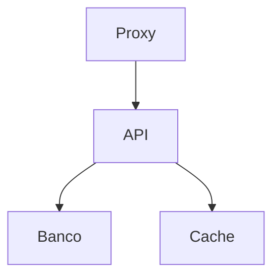

# django-boombox

Django-Boombox é um projeto base para o desenvolvimento API's RESTful feitas em python com o [django](https://github.com/django/django) e o [rest_framework](https://github.com/encode/django-rest-framework.git).

O objetivo do django-boombox é agilizar o inicio do desenvolvimento, instalando e configurando frameworks comuns a uma api, além de fornecer código com algumas funcionalidades úteis.

## Sobre

Inicialmente, o objetivo do repositório era servir como um projeto base para eu não ter que criar os mesmo aplicativos e modelos que sempre utilizaca, mas com o tempo vi que outros desenvolvedores utilizavam as mesmas configurações e dependências que as minhas, então decidi abrir o meu repositório.

## Por que python e Django?

O real motivo da escolha dessas tecnologias é: são as que eu domino, mas aqui vão alguns dos motivos porque eu, pessoalmente, recomendaria python e django para o seu projeto:

### python

- muita liberdade e facilidade para criar objetos extremamente personalizados
- as bibliotecas padrão do python por si só já resolvem diversos problemas na criação de uma api, tais como: logging, warings, serialização de json, entre outros
- se bem configurado, python consegue excelentes métricas de performance, podendo ser ainda melhor, caso você configure o ambiente de produção com [pypy](https://www.pypy.org/)
- gigantesca comunidade

### django

- gigantesca gama de funcionalidades estáveis e de fácil implementação
- extremamente prático
- performático
- extrema fácilidade de personalização do que for melhor para o seu projeto
- grandes empresas utilizam o django, como por exemplo o instagram, pinterest e o youtube, mostrando o nível de confiabilidade do framework

## Como utilizar esse projeto

Siga esses passos para iniciar o desenvolvimento da sua aplicação:

1. Após clonar o repositório, exclua do git para remover o versionamento direto com o respositório do boombox
2. Instale as dependencias
3. Preencha as variáveis de ambiente
4. Renomeie todas as constantes e suas utilizações que iniciem com o prefixo **BOOMBOX\_** com o nome do seu projeto.

## O que o projeto abrange

1. autenticação
1. banco de dados
1. multitenancy
1. cache
1. logs
1. variáveis de ambiente
1. deploy & produção
1. CI
1. ambiente de desenvolvimento

### Autenticação

A autenticação é feita com a biblioteca [djangorestframework-simplejwt](https://github.com/jazzband/djangorestframework-simplejwt) o qual é desenvovlido e mantido pela [jazzband](https://github.com/jazzband), uma grande comunidade, já consolidada no mundo open-source, focada em projetos python.

Para mais informações de funcionamento da biblioteca acesse a [documentação](https://django-rest-framework-simplejwt.readthedocs.io/en/latest/) e caso não esteja familiarizado com o JWT, acesse o [site oficial](https://jwt.io/)

### Banco de dados

O banco de dados escolhido foi o [postgres](https://www.postgresql.org/), devido a sua robustez e ampla gama de funcionalidades que ele provê e outros bancos relacionais não. Além disso, o django possui funcionalidades que são exclusivas com o postgres, como por exemplo, a personalização dos campos que serão utilizados pelo método `distinct` da queryset do django, como descrito na [documentação](https://docs.djangoproject.com/en/5.0/ref/models/querysets/#django.db.models.query.QuerySet.distinct).

**Porque postgres**

Alguns podem não gostar da escolha por conta do que eu gosto de chamar de "lendas urbanas" que dizem que o postgres é lento, ou pelo menos mais lento que o MySQL, porém aqui está a minha opnião:

> Performance nunca é um problema, até ser.

Em outras palavras, a velocidade de execução do seu projeto só vai ser um problema no dia em que ela faltar, a menos que seu projeto seja extremamente focado ou dependente da performance em si. Nesse caso, eu não recomendaria a utilização do python ou django para o desenvolvimento, mas sim escreve-la em [GO](https://go.dev/) com algum framework popular da linguagem.

Voltando para a questão inicial, bancos de dados são naturalmente extremamente rápidos e performáticos. Pode até ser que você visto um vídeo de um indiano falando do quanto MySQL é mais veloz em comparação ao postgres ou talvez tenha lido em 2 ou mais sites que, segundos dados dos benchmarks deles, o MySQL é 40% ou 50% mais rápido, mas na prática, estamos falando de 4ms ou 7ms a mais ou a menos na maioria das querys que a sua aplicação vai realizar, o que não representa um ganho significativo em comparação as features que o postgres fornece.

Além disso, como se tudo o que já foi dito não bastasse, o postgres tem a fama de ser mais estável e seguro do que o MySQL.

**Conclusão:** não compensa trocar toda todo o universo de funcionalidades e extensões do posgres e a sua robustez por um ganho de 4ms a 7ms. E mais, tais funcionalidades resolvem, diversas vezes, problemas complexos de maneira simples e fácil, desde que você conheça o postgres o suficiente para isso, fora que, caso sua aplicação precise de alguma dessas funcionalidades, você terá de desenvolve-las por contra própria, ou procurar alguma biblioteca externa.

### Multitenancy

Devido o django-boombox ser uma aplicação pensada para um SaaS, ele possui um esquema nativo para multi-tenancy, em cada requisição é setado o tenant no qual os dados serão acessados.

Isso é feito em [apps/system/core/authentications.py](https://github.com/davisilvarafacho/django-boombox/blob/70667cae72ebb191c8101966b2ed4042e1ad7310/apps/system/core/authentications.py)

### Cache

O framework de cache escolhido foi o [django-cachalot](https://github.com/noripyt/django-cachalot) devido a sua abordagem, facilidade de configuração e quantidade de testes que possui.

Devido o django-boombox ter uma multitênancia física - cada tenant tem seu banco de dados, o "cacheamento" é feito também, dessa forma, separando cada informação pelo seu tenant.

> [!IMPORTANT]
> O tipo de abordagem de cache ideal varia de aplicação para aplicação, no caso do django-cachalot ele guarda os dados retornados de uma query quando ela é executada, guardando toda a tabela no cache, pouco a pouco, mas caso você esteja desenvolvendo uma rede social ou algo uma aplicação que tenha um alto volume de escrita no banco, o django-cachalot não seria a ferramenta ideal.
> Para entender melhor, acesse a [documentação do projeto](https://django-cachalot.readthedocs.io/en/latest/introduction.html#comparison-with-similar-tools)

### Logs

Os logs dos modelos são feitos com o framework [django-auditlog](https://github.com/jazzband/django-auditlog), **funcionando apenas a nível de api**, ou seja, caso o seu banco de dados sofra qualquer alteração fora da api - seja via triggers do banco de dados ou alterações manuais, elas não serão registras e terão de ser feitas manualmente.

Os logs podem ser feitos [manualmente](https://django-auditlog.readthedocs.io/en/latest/usage.html#manually-logging-changes), ou automáticamente, como no exemplo abaixo:

```python
from auditlog.registry import auditlog

auditlog.register(MyModel)

```
Dessa forma todas as ações de criação, edição e deleção do registro serão feitas automáticamente. Caso vocẽ queira ter logs de visualização também é possível, além disso é possível personalizar quais campos serão auditados e quais não.

Para mais informações de funcionamento da biblioteca acesse a [documentação](https://django-auditlog.readthedocs.io/en/latest/)

### Variáveis de ambiente

O django-boombox define alguns padrões para varíaveis de ambiente:

1. Toda e qualquer varíavel deve ficar no arquivo `.env`, no diretório raiz
2. Toda variável tem o prefixo do escopo onde vai ser utilizada, exemplo: **DATABASE_PORT**. Neste exemplo **DATABASE** é escopo.

O django-boombox também possui algumas variáveis de ambiente personalizada:

**DJANGO_MODE**

Ele se refere ao "modo de execução" da api naquele momento e a partir dele surgem 2 constantes no `settings.py`: a `IN_DEVELOPMENT` e a `IN_PRODUCTION`.

Isso é útil porque nem sempre a constante `DEBUG` do `settings.py` nos fala tudo o que precisamos saber do atual estado da aplicação. As vezes colocamos a aplicação em produção com `DEBUG=True` para resolvermos um bug crítico. Logo, isso que certas funcionalidades que são feitas para serem executadas somente durante o desenvolvimento são garantidas 100%, além de melhorar a legibilidade do código.

```python
# menos legível
if settings.DEBUG:
    ...

# mais legível
if settings.IN_DEVELOPMENT:
    ...
```

> [!TIP]
> É uma boa prática não versionar o arquivo que contém as variáveis de ambiente, por isso quando for iniciar o versionamento do projeto descomente o arquivo `.env` do `.gitignore`.

**DJANGO_EXECUTION_MODE**

Essa variável serve para dizer à api se, em determinadas situações, deve lançar uma exceção ou se deve somente printar um warning no terminal, possuindo 2 possíveis valores:

**risky** - lança as exceções

**safety** - printa os warnings

### Deploy

As configurações do projeto para deploy são feitas com o [Docker](https://docker.com/). Caso você não o conheça, ele é uma ferramenta open-source de [containerizacão de processos](https://aws.amazon.com/pt/what-is/containerization/#:~:text=A%20conteineriza%C3%A7%C3%A3o%20%C3%A9%20um%20processo,ser%20executado%20em%20qualquer%20infraestrutura.), sendo a mais utilizada atualmente pelo mercado.

O django-boombox contém arquivos docker configurados de forma genérica para atender qualquer tipo de api que for desenvolvida a partir dele, mas caso você precise de algo mais específico, sinta-se livre para personaliza-los adicionando ou removendo alguns dos passos do processo de build.

**Estrutura**

As configurações e estrutura foram pensadas e voltadas para o ambiente de produção.

A estrutura, por padrão, conta com 4 containers: o **proxy**, a **api**, o **banco de dados** e o **cache**.

**O porque do proxy**

Colocar um [proxy](https://www.hostinger.com.br/tutoriais/servidor-proxy) na frente da sua api, além de ser uma boa prática, garante mais segurança para sua aplicação, uma vez que possíveis invasores não terão acesso direto a sua api, mas sim a um web server que oculta tudo o que está por trás dele, mantendo assim escondido detalhes que poderiam ser explorados para descobrir vulnerabilidades na sua api. Além disso, o proxy serve para servir os arquivos estáticos da sua aplicação, uma vez que você pense em utilizar o site administrativo do django ou os formulários do rest_framework, isso se torna essencial. Um outro bom motivo para tê-lo configurado é que, no futuro, caso você precise, o proxy pode servir como um [load balancer](https://docs.aws.amazon.com/pt_br/elasticloadbalancing/latest/network/introduction.html), balanceando a carga de trabalho para mais de uma api, ou como um [gateway](https://tecnoblog.net/responde/o-que-e-gateway/) garantindo mais segurança para o seu projeto.



**Django em produção**

O django suporta oficialmente 2 interfaces de comunicação para web servers: [WSGI](https://wsgi.readthedocs.io/en/latest/) e [ASGI](https://asgi.readthedocs.io/en/latest/). A interface escolhida foi o WSGI devido a famíliariadade do desenvolvedor com o a interface e com o web server escolhido para servir a aplicação, o [gunicorn](https://gunicorn.org/).

Para mais detalhes e informações sobre como configurar o django para produção, acesse a [documentação](https://docs.djangoproject.com/en/5.0/howto/deployment/).

**Como subir o deploy**

Antes de tudo é necessário ter o docker instalado em sua máquina, seja ela [linux](https://docs.docker.com/desktop/install/linux-install/) ou [windows](https://docs.docker.com/desktop/install/windows-install/).

Após instalado o docker, mova todos os arquivos da pasta docker para o diretório raiz.

Logo em seguida, execute o comando abaixo para iniciar a aplicação.

```docker
docker compose up --build -d
```

Caso tudo dê certo, você deve ver uma saída parecida com essa:

```
[+] Running 4/4
 ⠿ Container django-boombox-proxy  Started
 ⠿ Container django-boombox-api  Started
 ⠿ Container django-boombox-cache  Started
 ⠿ Container django-boombox-db  Started
```

Para mais informações sobre as configurações do deploy, acesse a [documentação do docker](https://docs.docker.com/)

### CI

O projeto é configurado com o [github actions](https://docs.github.com/pt/actions), que é uma plataformade [CI](https://www.atlassian.com/continuous-delivery/continuous-integration) do próprio github. Caso você utilize outra plataforma para versionamento, exclua a pasta `.github/`.

Também tenho planos de incluir uma configuração para CI e CD com o [Jenkins](https://www.jenkins.io/) no futuro.

### Ambiente de desenvolvimento

> [!NOTE]
> Para utilizar o ambiente de desenvolvimento é necessário ter o [docker](https://docs.docker.com/engine/install/) instalado na sua máquina.

O ambiente de desenvolvimento foi pensado para ser utilizado com o VSCode e sua extensão [dev containers](https://marketplace.visualstudio.com/items?itemName=ms-vscode-remote.remote-containers). Ele configura um container docker com python para o desenvolvimento, um para servir como banco de dados da aplicação e outro para servir como cache

O django-boombox não oferece suporte nativo para outras IDEs além do VSCode.

### Meu projeto não é uma API, ainda posso utiliza-lo apenas com o Django?

Sim, contudo, é recomendável que você remova todas as depedências que são diretamente ligadas a criação de uma api, perdendo uma grande parte das funcionalidades unidas no projeto do django-boombox, como por exemplo a autenticação e confirmação de email.

### Meu projeto é uma api, mas não utiliza o djangorestframework, ainda posso utiliza-lo como base?

A resposta curta é sim, mas acredito que será menos trabalhoso somente copiar/baixar os arquivos que você precisa do que clonar o repositório e remover as dependências e ajustar o código que você precisar.

### Como remover as dependências e funcionalidades que eu não vou utilizar?

Infelizmente o único jeito a se fazer isso no momento é apagar manualmente os arquivos e desisntalando as dependências com o comando `pip uninstall` ou apagando elas do arquivo `requirements.txt`. Contudo, já tenho em mente a criação de um CLI para configurar de maneira automática e personalizada as depedências de acordo com a preferencia do desenvolvedor.

Até a construação de CLI, vou tentar deixar o mais explícito e claro possível a localização dos arquivos e depedências, onde são usados e onde eles impactam.

## Frameworks e bibliotecas utilizados

1. django
1. djangorestframework
1. djangorestframework-simplejwt
1. django-cachalot
1. django-auditlog
1. django-cors-headers
1. django-multitenant
1. django-filter
1. django-threadlocals
1. django-redis
1. httpx
1. pika
1. pillow
1. psycopg2-binary
1. python-dotenv
1. sentry-sdk
1. pytest
1. backblaze r2 dsk
1. twilio
1. django-lifecycle

### Insipiração

https://github.com/Appdynamics/django-base-project
